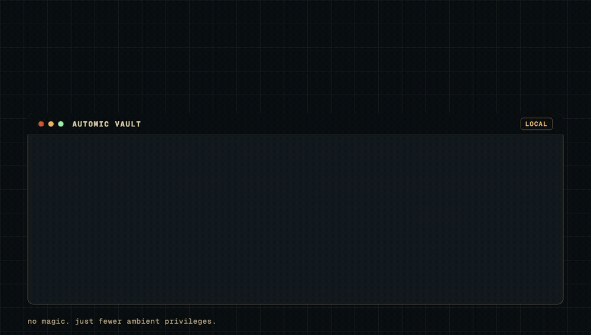

# Automic Vault

<p align="center">
  
</p>

Secure the tools you `brew install`.

Homebrew made installing developer tools effortless. AI agents changed who is
running them.

Automic Vault adds a local boundary beneath agent sessions: scan for plaintext
credentials, install agent-used packages under controlled roots, keep secrets in
the macOS Keychain, inject them only into approved processes, and ask a human
before commands cross a meaningful risk line.

No magic. Just fewer ambient privileges.

> [!IMPORTANT]
> Automic Vault is not affiliated with any cryptocurrency or token.

[](https://coveralls.io/github/automic-vault/automic-vault?branch=main)

&nbsp;


## Why Automic Vault

Developer machines are full of useful ambient authority: package paths, shell
startup files, dotenv files, cloud credentials, GitHub config, MCP servers, and
tools that can publish, delete, deploy, or mutate infrastructure.

Automic Vault makes that authority inspectable and gated:

- packages install as self-contained packages under controlled roots
- the app and `av` show package metadata, install state, updates, and security
  notes
- secrets are stored in the Automic Vault keychain, not `.env`, shell startup
  files, or model-readable config
- approved secrets are injected only into the process that needs them
- risky command execution can ask a human before it continues
- `av` can scan local files and isotope detectors for plaintext credentials
- `av contain` can run an agent command through a vaulted sandbox and proxy
  toolchain

&nbsp;


## Install It

```sh
curl -fsSL https://automicvault.com/install.sh | sh && av open
# ^^ downloads and mounts the DMG read-only
#    lets Gatekeeper inspect the app
#    verifies its signature and TeamIdentifier
#    copies Automic Vault.app into /Applications
#    sudo installs /usr/local/bin/av
```

If `curl | sh` gives you hives, fair. You can just download the DMG from
[GitHub releases][releases].

## Use It

```sh
$ av --help
# package installs, secret storage/injection, containment, trace, approval gates

$ av open
# opens Automic Vault.app

$ av info jq
# source, version, install state, dependencies, homepage, license

$ av install jq
# installs a self-contained package

$ av scan --path .
# finds plaintext credentials visible to agents

$ printf '%s\n' "$GITHUB_TOKEN" | av save GITHUB_TOKEN
# stores a trimmed secret in the Automic Vault keychain

$ av inject +GITHUB_TOKEN /opt/homebrew/bin/gh repo view
# asks Automic Vault to approve injecting that key into that process

$ av contain codex
# runs codex with generated stubs that request approved host execution
```

For the rest:

```sh
$ av <subcommand> --help
```

&nbsp;


## Guides

Pick the job you are actually trying to finish:

- [Stop exporting secrets from your shell][guide-secrets]: you have tokens in
  `.zshrc`, `.envrc`, or project `.env` files and want them out of files agents
  can read.
- [Use `av inject` from a script][guide-shebang]: you want a wrapper, deploy
  script, or helper command to request exactly the keys it needs at runtime.
- [Encrypt `.env` files][guide-dotenv]: you need project-local environment
  variables without committing or leaving plaintext credentials behind.
- [Run an agent through containment][guide-containment]: you want Codex,
  Claude, or another agent to attempt work while host tool execution goes
  through approval.
- [Trace an installer before running it][guide-trace]: you found a tiny
  `curl | sh` command and want to inspect likely file changes first.

&nbsp;


## What Ships

- `Automic Vault.app`: the package console, package dossiers, recommendations,
  update UI, and approval prompts
- `av`: the CLI for package, secret, approval, containment, trace, and local
  daemon workflows
- `nuke-helper`: the privileged helper for operations that need it
- isotope and approval-gate metadata for package-specific security behavior

## What This Is Not

No, this does not make agents safe.

No, this is not a replacement for your enterprise vault.

No, this is not a cloud policy engine.

It is a local macOS runtime boundary beneath agent sessions. That is already a
lot, and it is the part we can actually ship.

## Security Guarantees

Under the macOS security model, assuming the machine is not root-compromised,
System Integrity Protection is enabled, the
macOS Keychain is not compromised, and Automic Vault itself is not exploited,
secrets remain protected from ordinary apps, shell tools, malware, and agent
subprocesses. Hardened Runtime blocks normal debugger, injection, and
memory-scraping paths against our signed app, and Keychain only releases secrets
through the authorized Automic Vault code path.

> We also assume quantum computers are not generally accessible and that whoever
> currently has one poweful enough to break encryption does not have beef with
> you.

&nbsp;


## Platform

macOS: first. Linux & Windows: soon.

> [!NOTE]
> - 20k stars: we ship Linux
> - 50k stars: we ship Windows

## Hacking

```sh
$ cargo test
$ ./scripts/run-gui.sh
```

The native app lives in `src/gui`. The CLI and package/security core live in
`src/lib/rs` and `src/nucleus`.


[releases]: https://github.com/automic-vault/automic-vault/releases/latest
[guide-secrets]: https://www.automicvault.com/docs/#guide-secrets
[guide-shebang]: https://www.automicvault.com/docs/#guide-shebang
[guide-dotenv]: https://www.automicvault.com/docs/#guide-dotenv
[guide-containment]: https://www.automicvault.com/docs/#guide-containment
[guide-trace]: https://www.automicvault.com/docs/#guide-trace
