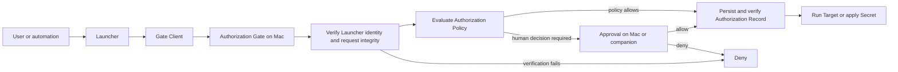

# Automic Vault Architecture

Automic Vault is a local authority system for developer credentials and controlled developer operations. It protects Secrets in custody, mediates their application, and gates sensitive execution at the Local Execution Boundary.

The [domain language](domain-language.md) is authoritative. The ADRs in [`docs/adr`](adr) record the decisions behind this architecture.

## Principles

### The Mac enforces authority

The Mac stores Secrets, verifies identities, evaluates policy, records decisions, and releases credentials. A companion device may carry a user's Approval response. It cannot release a Secret or execute a Target.

### Security uncertainty fails closed

Unknown operation risk requires Approval. Missing or invalid identity, integrity, request data, Secret matching, or required record persistence denies the request. No failure path grants broader access.

### Authority stays narrow

Policies bind a Gate and Verified Launcher. Approval binds one complete request and process. Blessings bind exact script contents and a complete declaration.

Optional Retained Launcher Provenance binds one Authorization Gate, one Verified
Launcher, and one exact live process execution. It preserves attribution after
ancestry loss; it does not preserve an Authorization Decision.

### The system is zeroconf above its boundary

Developer tools and agent harnesses use their existing commands. Automic Vault discovers and hardens integrations beneath that interface. Configuration remains where user intent or a security tradeoff requires it.

## Bounded contexts

### Exposure Detection

Detectors inspect the developer environment without changing it. A Scan produces Findings for supported Exposures and Hazards. It cannot certify the whole environment.

### Tool Hardening

Hardeners move supported Tools into a declared Hardened State. Doctor verifies the installed intervention and its dependencies. An Isotope supplies an Automic Vault-compatible build or wrapper where upstream behavior cannot support the required boundary. The Hardener delegates Isotope updates to Homebrew when the Isotope came from the tap. For a direct install, it verifies the release digest and Automic Vault code signature, installs into `/usr/local/bin`, and Doctor directs the user back to the Hardener when the tap publishes a new digest.

### Secret Custody

Automic Vault stores named opaque Secrets in the macOS Data Protection Keychain. Each Secret has an availability choice independent of authorization policy.

### Runtime Authorization

Authorization Gates verify the Launcher, bind the Gate Client and Target, classify the complete operation, apply the gate's Authorization Policy, request Approval when policy cannot allow it, and enforce the Authorization Decision.

The Direct Secret Gate handles direct `av inject` requests that do not match a
Tool-specific gate. It defaults to Approval Required. A user may add a Direct
Access Rule for one exact Secret Name and Verified Launcher, knowingly allowing
that Launcher to select the Target and arguments on future requests.

### Reviewed Automation

Script Blessings bind a canonical path, exact contents, Script Declaration, capabilities, and optional Launcher Endorsements. Execution uses a verified snapshot so file edits cannot race authorization.

### Distribution

The app, CLI, signed helpers, Isotopes tap and signed direct Isotope releases,
website, and companion app distribute and present the system. Distribution
supports the security contexts but does not define competing domain language or
policy semantics.

## Authorization flow

The Authorization Request is immutable across this flow. A cached decision may be reused only for the same live process and complete request identity. Reuse still requires an Authorization Record before Secret Application.

After a successful policy decision, Automic Vault may record Retained Launcher
Provenance for signed intermediary process executions.
If ordinary ancestry later disappears, that provenance may restore the original
Launcher only at the same Authorization Gate. The complete later request is
classified against current policy and receives a new Authorization Decision and
Authorization Record.

## Identity model

The policy identity is the Launcher's designated requirement, checked against the live process and its launch chain. Paths, process identifiers, names, and icons help the user recognize software but do not establish identity. Hardened Runtime requirements and rejected entitlements form part of launcher eligibility.

Eligible Launchers must enable Hardened Runtime. JIT executable-memory
exceptions and disabled library validation are supported compatibility
exceptions. Disabled library validation is presented as a warning because
third-party code loaded into the Launcher inherits its authority. DYLD
environment-variable injection, disabled executable-page protection, and
debugger attachment remain ineligible.

New durable Launcher rules store the accepted Launcher Runtime Requirement.
Every request rechecks the live signature and permits an equal or stronger
posture, so removing an exception is safe while adding an unacknowledged
exception fails closed. Existing strict rules remain strict. Compatibility
records that predate runtime requirements retain their established behavior.

Retained Launcher Provenance identifies an intermediary by its macOS process
execution identity, including PID version and process start time, and by its live
code identity. PID alone, PID plus start time, a pathname, or a basename is not
sufficient: `exec` preserves PID and start time while changing the executable
generation. Retained records are memory-only, are revalidated before use, and
expire when the process execution or menu bar helper exits.

The Gate Client and Target remain separate roles. A signed client submits the request. The Target performs the operation and may receive the Secret. Conflating them hides confused-deputy and target-substitution risks.

## Policy model

Each Authorization Gate owns one Authorization Policy:

1. The gate defines an explicit default Access Level.
2. Launcher-specific rules override that default for matching Verified Launchers.
3. An unverifiable Launcher receives no durable policy grant.
4. The classifier describes the operation's characteristics.
5. Policy must permit every characteristic for automic authorization.
6. Unknown prevents automic authorization.

Access Levels are named presets over operation characteristics. The user sees a small set of presets and concrete Approval reasons. The policy engine's target model keeps Homebrew Update, Local Write, System Write, Remote Write, Elevated Secret Application, Unconstrained Secret Application, and Secret Disclosure distinct.

Direct Access is available only at the Direct Secret Gate. It permits
Unconstrained Secret Application for exact Secret Names in the matching
Launcher’s Direct Access Rules. It does not turn unknown Tool operations into
recognized operations and does not apply to Tool-specific Gate Clients.

### Current compatibility model

The shipped policy store encodes one legacy classification per request and persists legacy access-level raw values in Keychain. The product retains those raw values while mapping them to canonical Access Levels:

- `noAccess` becomes Approval Required.
- `readOnly` becomes Read Only, except at the Homebrew Execution Gate where it becomes Read & Update.
- Homebrew's `readOnlyAndUpdates` becomes Read & Update.
- `readOnlyAndLocalWrites` becomes Local Write.
- `fullExceptSecretDumps` becomes Write Access.
- `fullIncludingSecretDumps` remains Full Access.

The Homebrew migration intentionally broadens persisted `readOnly` rules to allow explicit `brew update`. Homebrew could already update itself and its package metadata as a secondary effect of an authorized inspection command, so the old distinction did not enforce strict read-only execution. The legacy `update` classification covers only `brew update`, a Homebrew Update. The legacy `secretDump` classification covers both Secret Disclosure and AWS Elevated Secret Application. The legacy `mutating` classification can cover local, system, or remote effects. Replacing those values with characteristic sets is a policy-engine migration. It requires a reviewed Tool catalog, compatibility tests, and proof that no existing rule gains authority. Until that migration, the legacy classifier remains the enforcement source and the UI explains its established behavior with the canonical names.

## Secret custody and availability

Secret bytes stay in the app's private Keychain access group. Gate policy and Authorization History use separate services. Availability controls whether Keychain may return a Secret while the device is locked. Authorization controls whether the operation may receive it. Both checks must pass.

Direct Access Rules are authorization policy, not Secret Availability. They are
stored separately from Secret bytes. Renaming or deleting a Secret revokes its
rules so recreating an old Secret Name cannot silently restore authority.

Human Approval requires an active user session and awake displays. Requests that still need a human decision are denied if the session becomes inactive or the displays sleep. Policy-authorized requests may proceed while locked only when every requested Secret has Available While Locked enabled.

## Recording before release

An allowed Secret Use must produce a persisted, verified Authorization Record before the secret bytes leave custody. A failure to write or read back the record denies release. Denial and internal-failure records are best effort because recording failure must not replace the original denial with authority.

Authorization History is bounded local operational history. Same-user compromise or storage failure can damage it. Product copy must not promise an append-only audit trail or complete forensic evidence.

## Mediation limits

Wrappers and PATH stubs mediate the command path they occupy. They do not intercept every `exec`. A process can invoke an underlying executable by absolute path. Vault-managed Secrets should remain unavailable to that direct process, but ambient credential providers may still authorize it. Doctor can report resolution and integrity problems; it cannot turn PATH mediation into system-wide execution containment.

After Secret Application, the Target controls its own memory, plugins, helpers, child processes, and output. Authorization limits which Target receives a Secret. It does not prove that Target will keep it confidential.

## Secure defaults

New Secret Gates start at Read Only. The Homebrew Execution Gate starts at Read & Update, which adds `brew update` without authorizing installation, upgrade, reinstall, removal, or other writes. Unknown operations and unverifiable Launchers require a human decision or denial according to the failed check. Every default and Launcher-specific rule is explicit and persisted.

The Direct Secret Gate starts at Approval Required and has no broad default.
Adding each Direct Access Rule requires an explicit warning and acknowledgement.
Runtime signature or Hardened Runtime verification failure disables automic
authorization and falls back to Approval when human approval is available.
An eligible Launcher that disables library validation remains subject to its
exact designated requirement and live runtime check, and the UI warns that
loaded third-party code can inherit its authority.

Detached-process access is off by default. While it is off, Retained Launcher
Provenance may be observed in memory only to explain an Approval that the setting
would have avoided; shadow records cannot authorize. Enabling the setting
extends a verified Launcher's gate-specific attribution through a live signed
descendant after its original parent chain exits. The UI must explain that this
widens the lifetime of authority and that a Secure Launcher is safer for a
recurring mutable or injectable harness.

## Source of truth

This repository owns the domain language, architecture, and ADRs. Endorsed properties should adopt these terms and link here. Experimental integrations stay outside the canonical model until the project endorses them.
