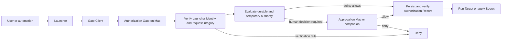

# Automic Vault Architecture

Automic Vault is a local authority system for developer credentials and controlled developer operations. It protects Secrets in custody, mediates their application, and gates sensitive execution at the Local Execution Boundary.

The [domain language](domain-language.md) is authoritative. The ADRs in [`docs/adr`](adr) record the decisions behind this architecture.

## Principles

### The Mac enforces authority

The Mac stores Secrets, verifies identities, evaluates policy, records decisions, and releases credentials. A companion device may carry a user's Approval response. It cannot release a Secret or execute a Target.

When iPhone Approval is enabled for a Mac, every human Approval—including an
Approval required to broaden durable authority—is carried by an eligible
iPhone unless the user separately enabled Touch ID Approval. The Mac never
exposes a pointer- or keyboard-driven allow action. Losing relay or phone
availability fails closed and does not enable another Approval surface.

### Security uncertainty fails closed

Unknown operation risk requires Approval. Missing or invalid identity, integrity, request data, Secret matching, or required record persistence denies the request. No failure path grants broader access.

### Authority stays narrow

Policies bind a Gate and Verified Launcher. Approval binds one complete request and process. Blessings bind exact script contents and a complete declaration.

Temporary Access Grants bind one Tool-specific Authorization Gate, one Verified
Launcher and accepted runtime posture, and one Agent Task Context for a fixed
ten-minute active-time budget. The user may suspend the countdown, which also
suspends the grant's authority, and resume with the frozen remainder. Agent Task
Context narrows matching but is not identity or a security boundary.

Optional Retained Launcher Provenance binds one Authorization Gate, one Verified
Launcher, and one exact live process execution. It preserves attribution after
ancestry loss; it does not preserve an Authorization Decision.

### The system is zeroconf above its boundary

Developer tools and agent harnesses use their existing commands. Automic Vault discovers and hardens integrations beneath that interface. Configuration remains where user intent or a security tradeoff requires it.

## Bounded contexts

### Exposure Detection

Detectors inspect the developer environment without changing it. A Scan produces Findings for supported Exposures and Hazards. It cannot certify the whole environment.

### Tool Hardening

Hardeners move supported Tools into a declared Hardened State. Doctor verifies the installed intervention and its dependencies. An Isotope supplies an Automic Vault-compatible build or wrapper where upstream behavior cannot support the required boundary. Each Automic Vault-maintained Tool fork produces and publishes its signed Isotope asset. The signed Isotopes Homebrew tap pins the expected fork release URL and digest. When Homebrew is available, the Hardener installs every tap Isotope through its fully qualified formula. Without Homebrew, executable-only Isotopes are verified against that same manifest and installed directly into `/usr/local/bin`; Automic Vault then assumes responsibility for their updates. Multi-file vendor distributions instead use a verified, root-owned package prefix under `/opt/av/<tool>`, as specified by [ADR 0031](adr/0031-isotope-installation-selection.md).

Hardener detection is point-in-time diagnostic state, not runtime authorization
evidence. Runtime Authorization consumes static Gate definitions and performs
the required live identity, integrity, request, policy, and recording checks at
the Local Execution Boundary.

A Hardener may instead install an unmodified vendor release when the upstream
artifact supports the boundary more safely than a package-manager build. That
path must verify the vendor and platform distribution identities, preserve
upstream code signatures, extract without executing installer scripts, install
into a root-owned non-user-writable location, and bind the Gate Client and
Target to that installed generation. Doctor verifies the resulting identity,
ownership, permissions, content manifest, and command resolution. See
[ADR 0012](adr/0012-verified-upstream-tool-releases.md).

A Hardener may bind a vendor-managed Target already installed outside Automic
Vault when protected Secrets are available only through an Automic Vault Gate
Client. Because that Target may remain user-writable and vendor-updated, its
path is never treated as integrity evidence. The gate verifies the live
process's vendor identity, signing identifier, runtime protections, arguments,
and process execution immediately before every Secret Application. Unknown
Targets and changed runtime posture fail closed. See
[ADR 0014](adr/0014-docker-credential-helper.md).

A command-aware wrapper may use a reviewed positive catalog to decide whether
an invocation may request Secret Application. Invocations outside that catalog
execute with the protected Secret removed from their environment and never
enter an Authorization Gate. This is least-authority routing before an
Authorization Request exists, not automic authorization of an Unknown
operation. See [ADR 0032](adr/0032-positive-secret-routing.md).

### Secret Custody

Automic Vault stores named opaque Secrets in the macOS Data Protection
Keychain. A Secret may contain a Global Value and Project Values. Each Secret
has one availability choice, shared by all its Values and independent of
authorization policy.

### Runtime Authorization

Authorization Gates verify the Launcher, bind the Gate Client and Target, classify the complete operation, apply the gate's Authorization Policy, request Approval when policy cannot allow it, and enforce the Authorization Decision.

The Direct Secret Gate handles direct `av inject` requests that do not match a
Tool-specific gate. It defaults to Approval Required. A user may add a Direct
Access Rule for one exact Secret Name and Verified Launcher, knowingly allowing
that Launcher to select the Target and arguments on future requests.

The approval service loads the signed app bundle's static Gate catalog when it
starts. Missing, malformed, empty, or duplicate definitions fail startup. An
exact request for a known Tool-specific Gate remains attached to that Gate
regardless of point-in-time Hardener detection and cannot fall through to the
broader Direct Secret Gate because a diagnostic check is unavailable.

For recognized agent Launchers, the service may read `CODEX_THREAD_ID` or
`CLAUDE_CODE_SESSION_ID` directly from the live XPC peer with a bounded
`KERN_PROCARGS2` query. It accepts only one canonical UUID from exactly one
provider and adds no client-controlled identity field to XPC. This label is an
Agent Task Context: same-user software can forge it, so the live Verified
Launcher remains the identity boundary.

An eligible live write-request Approval can create a Temporary Access Grant
with an initial ten minutes of active countdown time through an explicit prompt
action.
The grant is limited to Write Access at the exact Tool-specific gate, Launcher
designated requirement, accepted runtime posture, provider, and task UUID. The
Direct Secret Gate, Secret mutations, Elevated Secret Application, Secret
Disclosure, Unknown operations, and unverifiable Launchers are excluded.

The Varlock plugin collects every active, statically named Automic Vault
resolver before resolution and submits one multi-Secret Authorization Request
through its signed bridge. The request binds the Varlock schema digest, the
live Varlock resolution process, its live application parent, working
directory, requested Secret Names, selected Secret Value sources, and Verified
Launcher. One Approval covers that complete request only. Dynamic Secret Names,
transient reuse, durable policy, Blessings, and Retained Launcher Provenance do
not apply. The plugin and signed bridge use exact XPC protocol version 1, first
available in Automic Vault 3.9.0; either side rejects an incompatible version.

The Secret Proxy Gate handles `av proxy`. It gives the launched Target random
Secret References rather than raw Secret values, and a separately signed proxy
helper requests each Secret only when a reference appears in an outbound public
HTTP request. Proxy Sessions and Destination Rules are memory-only. They never
create Direct Access Rules, Launcher-specific policy, Blessings, or Launcher
Endorsements.

The GPG Signing Gate receives Git's immutable signing payload through the
bundled `av-gpg` Command. `av-gpg` invokes the adjacent signed `av gpg-sign`
Target without receiving credential bytes and delegates verification to GnuPG.
`av` binds a SHA-256 digest of the bounded payload into the Authorization
Request. The menu app verifies the live Launcher,
selects the default or alternate GPG Signing Credential from Keychain-protected
Launcher Signing Credential Rules, authorizes and records the complete Local
Write request, and releases exactly that credential to `av`. The Target creates
the detached signature in memory and zeroizes its transient input buffers.
Missing alternate material, invalid OpenPGP material, recording failure, or an
unrecognized route fails closed without falling back to the default credential.
Settings accepts imported private-key material only in a temporary editor and
never displays a stored private key. The adjacent signed `av` executable derives
the corresponding public key for display and can generate an EdDSA alternate
signing key for a user-supplied name and email. Generated private-key material is
confined to the adjacent signed `av` process and the Keychain-owning menu app,
which stores it after deriving its public key.
See [ADR 0019](adr/0019-gpg-signing-gate.md).

### Launcher Packaging

Launcher Bundles let one unsigned Mach-O command-line tool participate as a
Verified Launcher without treating its original path as identity. The attended
app flow snapshots the selected file, applies Hardened Runtime, signs the
payload and generated app inside-out with ad-hoc signatures, and displays both
the source and final signed-payload SHA-256 values before enrollment. An attended
privileged transaction installs the completed app under
`/Applications/Automic Vault/` and its root-owned command link under
`/usr/local/bin/`.

The reviewed candidate is bound to that privileged transaction by a
deterministic SHA-256 over every relative path and file byte in the completed
bundle. The new enrollment is staged alongside the old enrollment before one
administrator-authorized install; failure removes only the staged enrollment
and restores the old system artifact inside the same privileged process.

The command link preserves the CLI's ordinary Command without becoming identity
evidence. Installation refuses to replace an unrelated entry. Doctor verifies
the exact link and reports when another installation resolves first through
`PATH`.

Enrollment in the Data Protection Keychain binds a unique generation, exact
bundle and payload code identifiers for every supported architecture, final
payload digest, designated requirement, and accepted runtime posture. On every
authorization, the service verifies the live runner or enrolled payload
representative, strict nested bundle, payload digest, and enrollment. The runner
starts the fixed payload suspended and resumes it only when its live code
identifier matches the identifiers sealed into the runner's signed code. An
exact live payload at the enrolled bundle path may represent the same Launcher
Bundle Identity after the runner exits; it does not create another Launcher
Identity or depend on Retained Launcher Provenance. Reserved Launcher Bundle
identities that are moved, changed, re-signed, unenrolled, or unverifiable are
denied before ordinary Launcher admission or Approval. See
[ADR 0013](adr/0013-launcher-bundles.md).

Developer ID-signed generations created by earlier releases retain their
persisted signing metadata and the same strict enrollment checks. Replacing one
creates a new ad-hoc-signed generation and revokes the old generation normally.

### Reviewed Automation

Script Blessings bind a canonical path, exact contents, Script Declaration,
capabilities, and optional Launcher Endorsements. Execution normally uses a
verified snapshot so file edits cannot race authorization. A user may bless a
script whose interpreter cannot execute the snapshot after accepting a warning.
That script executes from its canonical path, remains vulnerable to edits
between verification and execution, and warns on every run. The Blessing stores
the override, so existing Blessings must be reviewed again before they can use
canonical-path execution.

### Distribution

The app, CLI, signed helpers, signed fork Isotope releases and Isotopes tap,
website, and companion app distribute and present the system. Distribution
supports the security contexts but does not define competing domain language or
policy semantics.

## Authorization flow

The Authorization Request is immutable across this flow. A cached decision may
be reused only for the same live process and complete request identity. This is
independent of whether the original Approval was carried on Mac, by iPhone, or
with Touch ID: the Authorization Decision is reused, not the human-presence or
biometric result. Reuse still requires an Authorization Record before Secret
Application. Operations that may receive long-lived AWS credentials remain
excluded and require fresh Approval.

An active Blessing is evaluated before a Temporary Access Grant. A matching
grant may authorize a recognized operation beyond a narrower Blessing only
inside the grant's exact scope. Matching happens after ordinary Gate Client,
Target, request, Secret, gate, Launcher, and runtime verification succeeds.
Before presenting a queued Approval, the service checks Temporary Access Grants
again against the still-live Gate Client, current Agent Task Context, and
freshly verified Launcher and runtime posture. This permits a matching request
received before grant activation to receive its Authorization Decision under
the now-active grant without trusting stale eligibility evidence.
Each use persists its Authorization Record as policy-authorized by “Temporary
Access Grant — Write Access” before release. The controller holds a
generation-bound lease through payload loading, record persistence, retained
provenance recording, and the XPC reply, so expiry or cancellation cannot race
with an in-progress release.

After a recorded Secret Use releases or makes Secret Values available to a
Target process, the menu bar app keeps a memory-only Live Secret Use while that
process lifetime remains observable. For `av inject`, observation follows the
same PID, start time, user, and audit session across the Gate Client's `exec`
transition because Secret Values can survive `exec`; this observation is never
used as identity evidence. Varlock binds the already-live application process,
and process-based credential helpers bind their verified parent Target. The
menu shows any available Verified Launcher attribution, Target, and Secret
Names. Process liveness changes display state only: it grants no authority and
cannot revoke Secret Values already released.

Grants are memory-only and running countdowns use both wall-clock and monotonic
deadlines. Suspending freezes the lesser remaining duration from those clocks
and makes the grant ineligible to authorize requests. Resuming creates new
paired deadlines from that frozen remainder. An explicit extension adds ten
minutes to both running deadlines or to the frozen remainder; it cannot revive
an expired grant. An exact duplicate scope is replaced by a newly confirmed,
running ten-minute generation. The service
revokes every grant on user session inactivity, display sleep, update
installation, service stop, or app termination. Individual expiry, suspension,
resumption, and explicit End actions require no authentication.

After a successful policy decision, Automic Vault may record Retained Launcher
Provenance for signed intermediary process executions.
If ordinary ancestry later disappears, that provenance may restore the original
Launcher only at the same Authorization Gate. The complete later request is
classified against current policy and receives a new Authorization Decision and
Authorization Record.

## Identity model

The policy identity is the Launcher's designated requirement, checked against the live process and its launch chain. Paths, process identifiers, names, and icons help the user recognize software but do not establish identity. Hardened Runtime requirements and rejected entitlements form part of launcher eligibility.

An app's declared main executable may represent the app after its code signature
and exact membership in the app's resource seal are validated. A non-main
executable may represent the app only as an enabled Verified Launcher Helper
whose exact app and helper signing identities appear in the built-in positive
catalog. Disabled catalog entries are stored in the Data Protection Keychain;
missing or malformed stored configuration fails closed except that a genuinely
absent record uses the built-in defaults. Runtime verification binds the live
helper to the on-disk executable, validates the app executable, and validates
the exact helper as a required, unaltered member of the app's resource seal.
Unrelated app resources are not Launcher Identity evidence and are not scanned.
If targeted resource validation is unavailable, Automic Vault falls back to
complete bundle validation. Other bundle-contained executables do not inherit
the app identity. Launcher Bundles retain their complete enrolled-bundle and
payload verification. See [ADR 0020](adr/0020-app-launcher-main-executable.md)
and [ADR 0033](adr/0033-targeted-app-launcher-validation.md).

Eligible Launchers must enable Hardened Runtime or be Apple platform binaries
signed as part of a macOS release, for which macOS applies the runtime
protections intrinsically. JIT executable-memory exceptions and disabled
library validation are supported compatibility exceptions. Disabled library
validation is presented as a warning because third-party code loaded into the
Launcher inherits its authority. DYLD environment-variable injection, disabled
executable-page protection, and debugger attachment remain ineligible.

New durable Launcher rules store the accepted Launcher Runtime Requirement.
Every request rechecks the live signature and permits an equal or stronger
posture, so removing an exception is safe while adding an unacknowledged
exception fails closed. Existing strict rules remain strict. Compatibility
records that predate runtime requirements retain their established behavior.

Temporary Access Grants store the live accepted Launcher Runtime Requirement
and require an exact posture match on every use. This intentionally rejects a
runtime posture change in either direction during the short grant instead of
silently changing its scope.

Retained Launcher Provenance identifies an intermediary by its macOS process
execution identity, including PID version and process start time, and by its live
code identity. PID alone, PID plus start time, a pathname, or a basename is not
sufficient: `exec` preserves PID and start time while changing the executable
generation. Retained records are memory-only, are revalidated before use, and
expire when the process execution or menu bar helper exits.

The Gate Client and Target remain separate roles. A signed client submits the request. The Target performs the operation and may receive the Secret. Conflating them hides confused-deputy and target-substitution risks.

Every Approval presents the available live process path between the Target and
Verified Launcher. Each process reports whether its live code signature
is valid and whether its Hardened Runtime posture meets the same baseline used
for Launcher eligibility. The Gate Client is identified separately because it
may transport a request without being the Target or an ancestor of the Target.
An interpreter that executes mutable source is called out even when its own
executable is signed and hardened: executable posture does not authenticate the
application source, dependencies, plug-ins, or native extensions that can
observe a Secret after Application. These findings inform Approval; they do not
create authority, replace Target verification, or imply that a Target will keep
a Secret confidential.

For `av proxy`, the CLI remains the Gate Client and the signed proxy helper is
the immediate Secret Target. The launched executable is bound as the Proxy
Session Target and receives bearer Secret References. Its PID version, start
time, and available live code identity constrain session lifetime. They do not prove the
origin of an individual loopback TCP connection.

## Policy model

Each Authorization Gate owns one Authorization Policy:

1. The gate defines an explicit default Access Level.
2. Launcher-specific rules override that default for matching Verified Launchers.
3. An unverifiable Launcher receives no durable policy grant.
4. The classifier describes the operation's characteristics.
5. Policy must permit every characteristic for automic authorization.
6. Unknown prevents automic authorization.

Access Levels are named presets over operation characteristics. The user sees a small set of presets and concrete Approval reasons. The policy engine's target model keeps Homebrew Update, Local Write, System Write, Remote Write, Elevated Secret Application, Unconstrained Secret Application, and Secret Disclosure distinct.

Direct Access is available only at the Direct Secret Gate. It permits
Unconstrained Secret Application for exact Secret Names in the matching
Launcher’s Direct Access Rules. It does not turn unknown Tool operations into
recognized operations and does not apply to Tool-specific Gate Clients.

### Current compatibility model

The shipped policy store encodes one legacy classification per request and persists legacy access-level raw values in Keychain. The product retains those raw values while mapping them to canonical Access Levels:

- `noAccess` becomes Approval Required.
- `readOnly` becomes Read Only, except at the Homebrew Execution Gate where it becomes Read & Update.
- Homebrew's `readOnlyAndUpdates` becomes Read & Update.
- `readOnlyAndLocalWrites` becomes Local Write.
- `fullExceptSecretDumps` becomes Write Access.
- `fullIncludingSecretDumps` remains Full Access.

At the GPG Signing Gate, persisted values that permit Local Write normalize to
Allow Signing; all others normalize to Approval Required. This preserves each
stored rule's effective signing authority while omitting policy presets that
cannot describe a distinct GPG operation.

The Homebrew migration intentionally broadens persisted `readOnly` rules to allow explicit `brew update`. Homebrew could already update itself and its package metadata as a secondary effect of an authorized inspection command, so the old distinction did not enforce strict read-only execution. The legacy `update` classification covers only `brew update`, a Homebrew Update. The legacy `secretDump` classification covers both Secret Disclosure and AWS Elevated Secret Application. The legacy `mutating` classification can cover local, system, or remote effects. Replacing those values with characteristic sets is a policy-engine migration. It requires a reviewed Tool catalog, compatibility tests, and proof that no existing rule gains authority. Until that migration, the legacy classifier remains the enforcement source and the UI explains its established behavior with the canonical names.

## Secret custody and availability

Secret bytes stay in the app's private Keychain access group. Gate policy and Authorization History use separate services. Availability controls whether Keychain may return a Secret while the device is locked. Authorization controls whether the operation may receive it. Both checks must pass.

For each requested Secret Name, the menu bar app selects a Value from the
Authorization Request's working directory. It examines that physical canonical
directory and each physical parent on the same filesystem. The nearest Project
Value wins; otherwise the Global Value is used. If neither exists, the Secret is
missing. Selection does not inspect `.git`, Git configuration, environment
variables, or repository metadata, and it does not cross a filesystem boundary.

The app resolves every selected Value before authorization, binds the exact
sources into the immutable Authorization Request and Authorization Record, and
loads those exact Keychain items only after authorization succeeds. Failure to
read a selected Value denies the request; it never falls back to an ancestor or
Global Value.

A Project Directory path is selection context supplied by the Gate Client, not
an authority boundary or software identity. Name-based policy, including Direct
Access Rules and Blessings, applies to all Values of that exact Secret Name. A
Launcher with authority for a Secret may choose a working directory and thereby
choose among its Values.

Availability and renaming apply to every Value of a Secret. Multi-item
mutations persist a forward-repair journal before changing Value items. The app
resumes an interrupted operation, and affected Secret Names remain unavailable
until repair completes. Removing one Value retains name-based policy while
another Value remains; removing the last Value deletes the Secret and revokes
its Direct Access Rules.

A Gate Client's code signature authenticates the component but grants no
authority to retrieve an existing Secret. The approval service exposes no
generic Secret-load operation. Existing Secret bytes may leave custody only as
the payload of a complete Secret Application or Secret Disclosure after its
Authorization Decision and verified Authorization Record. Checks used while
storing or migrating Secrets compare and verify values inside the menu bar app
and return status only.

Direct Access Rules are authorization policy, not Secret Availability. They are
stored separately from Secret bytes. Removing one Value does not revoke rules
while the Secret retains another Value. Renaming a Secret or deleting its last
Value revokes its rules so recreating an old Secret Name cannot silently restore
authority.

Human Approval requires an active user session and awake displays. Requests that still need a human decision are denied if the session becomes inactive or the displays sleep. Policy-authorized requests may proceed while locked only when every requested Secret has Available While Locked enabled.

iPhone Approval changes the human-presence surface, not the Local Execution
Boundary. While enabled and backed by at least one registered iPhone, a pending
request may remain eligible for Approval while the Mac session is inactive or
its displays sleep. The originating process must remain alive, and the Mac must
still validate the exact response and persist and verify its Authorization
Record before allowing the operation. AWS MFA entry remains Mac-local and keeps
the active-session and awake-display requirement.

Touch ID Approval remains Mac-local and therefore keeps the active-session and
awake-display requirements. Each allow action evaluates biometric-only Local
Authentication with no reuse interval or credential and companion fallback.
The result applies only to the exact Approval panel or authority change that
requested it.

## iPhone Approval

iPhone Approval uses a product-specific 256-bit account root key generated on
an Apple device and stored as a synchronizable iCloud Keychain item. It does not
reuse another product's key. Possession of this key makes every eligible iPhone
on that iCloud Keychain account an Approval carrier for every enrolled Mac.
There is no per-device pairing or revocation in the initial design.

The root key derives independent keys and opaque identifiers for relay routing,
relay authorization, Authorization Requests, responses, cancellations, and
device registration. Request and response envelopes are authenticated and
encrypted before reaching the relay. Responses bind the request identifier and
digest of the complete immutable request. The first valid response accepted by
the Mac wins; stale, modified, replayed, or mismatched responses are rejected.

The relay may observe opaque routing identifiers, ciphertext size, timing,
delivery status, and APNs device tokens required for delivery. It cannot read or
forge Authorization Requests or responses. It stores no request history. It
durably retains only opaque revoked room identifiers so emergency recovery
continues to invalidate old keys after a relay restart.
Pending requests remain authoritative on their Macs and are republished after a
relay reconnect. A relay restart may delay an Approval and may lose an
unacknowledged response; either case fails closed.

An iPhone registers only after proving possession of the account root key and
obtaining notification authorization and an APNs token. A Mac may enable iPhone
Approval only after observing a recent eligible registration. Once enabled,
APNs delivery is a wake-up mechanism rather than proof that a notification was
shown. The phone is the sole allow surface until the feature is deliberately
disabled or recovered.

Notification Approvals bind the same exact request as the full app. Requests
with Unknown operation risk, Secret Disclosure, Unconstrained Secret
Application, or a security warning require review in the full iPhone app.
Notification content is redacted on the lock screen and never includes Secret
values. The iPhone does not persist Authorization History. It may keep at most
50 protected, device-local iPhone Activity entries for responses successfully
sent from that phone. These summaries omit Secret Names, working directories,
and expanded request details, are excluded from backup, and do not claim that
the Mac accepted a response.

Before signing and transmitting any allow response, the iPhone app verifies a
current iPhone Approval subscription from StoreKit's signed transaction ledger.
Missing, expired, revoked, or unverified entitlement state fails closed. Denial
does not require a subscription. Subscription state is not sent to the relay or
Mac and does not participate in Authorization Policy; a subscription never
authorizes a request or weakens the Mac's response validation and recording
requirements.

Biometric protection is optional and configured independently on each iPhone.
When enabled, an Approval requires Face ID or Touch ID on that physical iPhone,
without passcode or companion-Mac fallback; Apple Watch Approval is then
unavailable. When disabled, actionable notifications may also appear on Apple
Watch. Deny is the first non-destructive notification action so Apple Watch
Double Tap cannot approve.

iPhone Mirroring and forwarding iPhone notifications to a Mac can weaken the
intended physical separation when biometrics are disabled. Setup warns the user
and points to Apple's per-app Show on Mac and Mirroring controls. The product
does not claim a physical-phone boundary unless biometric protection is enabled
on every eligible iPhone.

Emergency recovery requires macOS system authentication, disables iPhone
Approval, cancels pending requests, rotates the account root key, and
invalidates all prior phone registrations across the account. Re-enrollment is
account-wide. Ordinary disable and re-enable does not rotate the key.

## Touch ID Approval

Touch ID Approval is a separately enabled Mac-local human-presence surface. Its
choice is stored in the app's Data Protection Keychain so same-user software
cannot add the surface by editing preferences. Enrollment first uses the current
human Approval surface to authorize the broader authority model, then requires
Touch ID on that Mac. Disabling it removes authority and is immediate.

Every use creates a new Local Authentication context, disables biometric result
reuse, and requests biometrics only. A password, passcode, Apple Watch, or
pointer-driven allow action cannot satisfy it. When iPhone Approval is also
enabled, either a valid phone response or a successful Touch ID evaluation may
carry the Approval; the first result wins and the other pending transport is
canceled. Relay state never toggles this choice. Memory-only reuse of the exact
Authorization Decision under the ordinary live-process and complete-request
constraints does not reuse the Local Authentication result.

## Recording before release

An allowed Secret Use must produce a persisted, verified Authorization Record before the secret bytes leave custody. A failure to write or read back the record denies release. Denial and internal-failure records are best effort because recording failure must not replace the original denial with authority.

No trusted-client shortcut may bypass this ordering. A signed Gate Client may
submit an Authorization Request or an approved Secret mutation; it may not ask
the menu bar app to return an arbitrary existing Secret for client-side
inspection or migration.

Authorization History is bounded local operational history. Same-user compromise or storage failure can damage it. Product copy must not promise an append-only audit trail or complete forensic evidence.

For an automically authorized Secret Use, the Authorization Record includes the
Target's available Hardened Runtime posture at authorization time. Ordinary
`av inject` requests inspect the resolved Target executable because it has not
started yet; integrations with an existing Target process inspect that live
process. Missing or unsafe posture is recorded as exposure information without
changing the Authorization Decision.

The exact Agent Task Context UUID is not part of the Authorization Record or
telemetry. History identifies the Temporary Access Grant decision source,
Verified Launcher, Authorization Gate, and operation without persisting the
forgeable task label.

## Mediation limits

Wrappers and PATH stubs mediate the command path they occupy. They do not intercept every `exec`. A process can invoke an underlying executable by absolute path. Vault-managed Secrets should remain unavailable to that direct process, but ambient credential providers may still authorize it. Doctor can report resolution and integrity problems; it cannot turn PATH mediation into system-wide execution containment.

After Secret Application, the Target controls its own memory, plugins, helpers, child processes, and output. Authorization limits which Target receives a Secret. It does not prove that Target will keep it confidential.

The Secret Proxy adds a narrower but still bearer-based boundary. The launched
Target does not receive raw Secret bytes from Automic Vault, but it controls its
Secret References, Proxy Credential, requests, dependencies, children, and
responses. Same-user code that can inspect or modify an unhardened Target may
use those bearer values. Even with per-flow PID attribution, injected code would
act from the approved process. The UI therefore reports Target Hardened Runtime
posture without making it a condition for manual Approval.

The proxy helper is separately signed, enables Hardened Runtime without
exceptions, has no Keychain authority, and receives only the Secrets needed for
one authorized request. Network parsing is outside the Keychain-owning app.

## Secure defaults

New Secret Gates start at Read Only. The GPG Signing Gate starts at Approval
Required and exposes Allow Signing as its only automic level. The Homebrew
Execution Gate starts at Read & Update, which adds `brew update` without
authorizing installation, upgrade, reinstall, removal, or other writes. Unknown
operations and unverifiable Launchers require a human decision or denial
according to the failed check. Every default and Launcher-specific rule is
explicit and persisted.

The Direct Secret Gate starts at Approval Required and has no broad default.
Adding each Direct Access Rule requires an explicit warning and acknowledgement.
Runtime signature or Hardened Runtime verification failure disables automic
authorization and falls back to Approval when human approval is available.
An eligible Launcher that disables library validation remains subject to its
exact designated requirement and live runtime check, and the UI warns that
loaded third-party code can inherit its authority.

A failed Launcher Bundle integrity or enrollment check is stricter: it denies
the request and cannot fall through to Approval or ordinary signed-app
eligibility. This prevents a changed or copied generated bundle from retaining
authority by being re-signed.

Detached-process access is off by default. While it is off, Retained Launcher
Provenance may be observed in memory only to explain an Approval that the setting
would have avoided; shadow records cannot authorize. Enabling the setting
extends a verified Launcher's gate-specific attribution through a live signed
descendant after its original parent chain exits. The UI must explain that this
widens the lifetime of authority and that a Launcher Bundle can bring a
recurring mutable or injectable harness up to Verified Launcher requirements.
An enrolled Launcher Bundle payload representing its own bundle is not Retained
Launcher Provenance and does not require this setting.

While any Temporary Access Grant exists, a non-activating strip remains visible
directly below the menu-bar item with every scoped grant, second-accurate
remaining active time, suspension state, successful-use count, last-use time,
and Add 10 Minutes, End, and countdown-toggle actions. The menu mirrors these
actions and the shield turns orange. Automatic-request notifications stack
below the strip. This continuous presentation is part of the temporary
escalation's safety model, not a source of authority.

## Source of truth

This repository owns the domain language, architecture, and ADRs. Endorsed properties should adopt these terms and link here. Experimental integrations stay outside the canonical model until the project endorses them.
